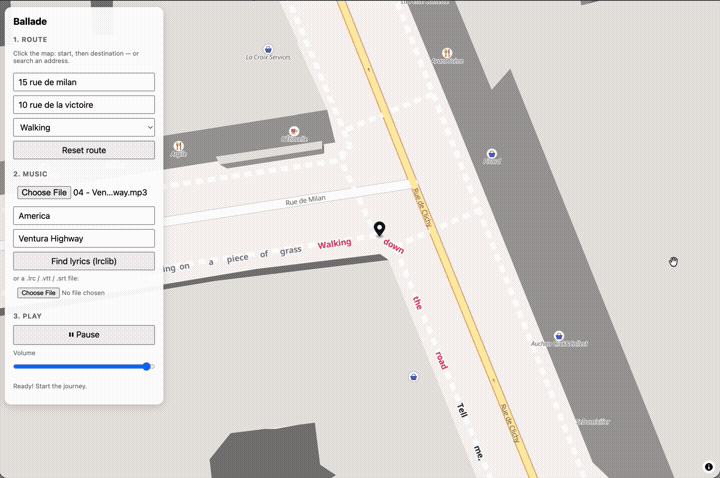

# Ballade 🎶🗺️

*A "ballade" that becomes a "balade" — French for both a song and a stroll.*

The lyrics of whatever you're listening to, written along your route on the map:
upcoming lyrics ahead of you, the current line highlighted karaoke-style, and behind
you, greyed out, everything the city has already sung.

## Demo

*Click the preview for the full video (with sound).*

## Getting started

    npm install
    npm run dev

## Usage

1. **Route** — click the map for the start and the destination (the fields fill in
   automatically) or search addresses, pick a mode (walking / cycling / driving),
   and choose a basemap (Liberty / Bright / Positron) from the map control.
2. **Music** — drop one or more audio files: they queue up as a playlist you can
   reorder. Synced lyrics are fetched per track from [lrclib.net](https://lrclib.net)
   using each file's tags; otherwise select a track and provide a `.lrc` (music) or
   `.srt`/`.vtt` (podcast transcript).
3. **Play** — the journey begins at a realistic, constant pace (derived from the
   router's estimated travel time): the camera follows your simulated position, each
   word is drawn along the stretch covered while its song plays, the current line
   lights up, and lyrics already sung stay greyed out behind you.

The journey and the music negotiate the difference:

- **Trip longer than the playlist?** The journey continues in silence — drop more
  songs at any moment and the music resumes right where you are.
- **Music longer than the trip?** Ballade offers a scenic detour via POIs picked
  from your lyrics (Overpass + OSRM); otherwise the current song finishes at the
  destination.

## Demo without an MP3

    node scripts/make-demo-wav.mjs   # generates samples/demo.wav (60 s)

Then load `samples/demo.wav` + `samples/chanson-automne.lrc` (Verlaine, public domain).

## Tests

    npm test         # Vitest (parsers, geometry, timeline, playlist, mocked HTTP clients)
    npm run typecheck

Design docs (in French): `docs/superpowers/specs/`.
